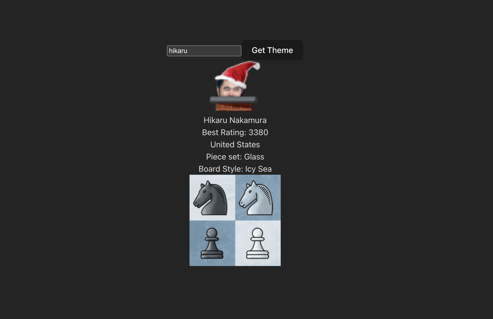

# Chess.com Theme Finder

An extremely basic app which lets you look up any user's theme by simply entering their username.

## [Try It Out!](https://mattbruv.github.io/chesscom-theme-finder/)

As far as I can tell, theme data is not normally exposed via any normal public API endpoint.
However, theme data is shared with the user when they get paired with a person in-game.
Since the theme API requires a user GUID, this app first queries another non-public endpoint to get the internal user GUID to then query the theme for that user.

